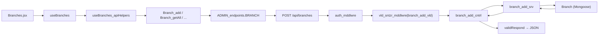

# Cloud Kitchens — Phase 1, Step 1 (Branch CRUD, end-to-end)

## 1. Guiding decisions (locked)

- **Routes:** pure REST. `POST /api/branches`, `GET /api/branches`, `GET /api/branches/:id`, `PUT /api/branches/:id`, `DELETE /api/branches/:id`.
- **File layout per resource:** keep your per-action controller/service/validator files (one file per verb), wired to the matching HTTP verb in the router. This preserves the convention used in [backEnd/07_controllers/userCntrl/](backEnd/07_controllers/userCntrl/) without forcing action-based URLs.
- **Validation strictness:** Phase 1 minimal — `name: required` only; all other fields pass through sanitization untouched.
- **All new routes protected by** `auth_mddlwre`, exactly like the signout route in [backEnd/08_routes/userRoutes.js](backEnd/08_routes/userRoutes.js).
- **Cloud Kitchens lives in its own top-level admin feature** `03_cloudKitchens/` (Vkusno stays as a brand-specific feature under `01_vkusno/`).

## 2. Schema note — leave [backEnd/06_models/Branch.js](backEnd/06_models/Branch.js) as-is

It is already written. For Phase 1 the only thing to check is that the file is exported from [backEnd/06_models/\_models.index.js](backEnd/06_models/_models.index.js). All other fields are optional and non-validated, so CRUD will function without changes.

Flagged items for a future pass (NOT done now):

- `Branch.brands[]` and `Brand.aggregators[]` are derivable from `Outlet` — remove once `Outlet` lands.
- Extended validations come in Phase 2, per the doc.

## 3. Backend work — Branch resource

### 3.1 New files

```
backEnd/
  06_models/
    _models.index.js                          ← add: export { default as Branch } from "./Branch.js";

  07_controllers/
    branchCntrl/
      _branchCntrl.index.js                   ← barrel: re-exports 5 controllers
      branchCntrl_crud/
        branch_add_cntrl.js
        branch_getAll_cntrl.js
        branch_getOne_cntrl.js
        branch_update_cntrl.js
        branch_delete_cntrl.js
      _utils/
        branchCntrl_utils.index.js            ← barrel: re-exports 5 services + 5 validators
        branchServices/
          branchServices_crud/
            branch_add_srv.js
            branch_getAll_srv.js
            branch_getOne_srv.js
            branch_update_srv.js
            branch_delete_srv.js
        branchValidators/
          branchValidators_crud/
            branch_add_vld.js                 ← name required, rest passthrough
            branch_getOne_vld.js              ← id is valid ObjectId
            branch_update_vld.js              ← id valid; name (if provided) non-empty
            branch_delete_vld.js              ← id valid
            (branch_getAll_vld.js optional — no body to validate)

  08_routes/
    branchRoutes.js
    _routes.index.js                          ← add: export { default as branchRoutes } from "./branchRoutes.js";

  server.js                                   ← add: app.use("/api/branches", branchRoutes);
```

### 3.2 Shape of each file (mirroring signup pattern)

Controller (`branch_add_cntrl.js`) — thin HTTP layer, like [user_signUp_cntrl.js](backEnd/07_controllers/userCntrl/userCntrl_auth/user_signUp_cntrl.js):

```javascript
import { branch_add_srv } from "../_utils/branchCntrl_utils.index.js";
import {
  validRespond,
  catch_errorHandler_cntrl,
} from "../../../03_services/_services.index.js";

const displayName = " | branch_add_cntrl.js | ";
const isDebug = true;

const branch_add_cntrl = async (req, res) => {
  try {
    const { success, message, data } = await branch_add_srv(req, isDebug);
    return validRespond(res, isDebug, displayName, success, message, data);
  } catch (error) {
    return catch_errorHandler_cntrl(res, displayName, isDebug, error);
  }
};

export default branch_add_cntrl;
```

Service (`branch_add_srv.js`) — business logic + DB, like [user_signUp_srv.js](backEnd/07_controllers/userCntrl/_utils/userServices/userServices_auth/user_signUp_srv.js).

Validator (`branch_add_vld.js`) — returns `{ isValid, message, sanitizedData }` via `request_success` / `request_failed`, like [user_signUp_vld.js](backEnd/07_controllers/userCntrl/_utils/userValidators/userValidators_auth/user_signUp_vld.js). For Phase 1, only `name` is required; everything else is assigned verbatim into `sanitizedData`.

Router ([backEnd/08_routes/branchRoutes.js](backEnd/08_routes/branchRoutes.js)):

```javascript
import express from "express";
import {
  vld_sntzr_mddlwre,
  auth_mddlwre,
} from "../05_middlewares/_mddlwre.index.js";
import {
  branch_add_cntrl,
  branch_getAll_cntrl,
  branch_getOne_cntrl,
  branch_update_cntrl,
  branch_delete_cntrl,
} from "../07_controllers/branchCntrl/_branchCntrl.index.js";
import {
  branch_add_vld,
  branch_getOne_vld,
  branch_update_vld,
  branch_delete_vld,
} from "../07_controllers/branchCntrl/_utils/branchCntrl_utils.index.js";

const router = express.Router();

router.post(
  "/",
  auth_mddlwre,
  vld_sntzr_mddlwre(branch_add_vld),
  branch_add_cntrl,
);
router.get("/", auth_mddlwre, branch_getAll_cntrl);
router.get(
  "/:id",
  auth_mddlwre,
  vld_sntzr_mddlwre(branch_getOne_vld),
  branch_getOne_cntrl,
);
router.put(
  "/:id",
  auth_mddlwre,
  vld_sntzr_mddlwre(branch_update_vld),
  branch_update_cntrl,
);
router.delete(
  "/:id",
  auth_mddlwre,
  vld_sntzr_mddlwre(branch_delete_vld),
  branch_delete_cntrl,
);

export default router;
```

## 4. Frontend work — branches page

### 4.1 Endpoint config

Extend [frontEnd/src/03_config/apiEndpoints/adminEndpoints/ADMIN_endpoints.js](frontEnd/src/03_config/apiEndpoints/adminEndpoints/ADMIN_endpoints.js) with a `BRANCH` section:

```javascript
BRANCH: {
  ADD:     { ENDPOINT: `${BASE_URL}/branches`,          DISPLAY_NAME: "Branch_add.js",    PROPERTIES: (body) => ({ method:"POST",   credentials:"include", headers:{...}, body: JSON.stringify(body) }) },
  GET_ALL: { ENDPOINT: `${BASE_URL}/branches`,          DISPLAY_NAME: "Branch_getAll.js", PROPERTIES:        { method:"GET",    credentials:"include", headers:{...} } },
  GET_ONE: { ENDPOINT: (id) => `${BASE_URL}/branches/${id}`, DISPLAY_NAME:"Branch_getOne.js", PROPERTIES:     { method:"GET",    credentials:"include", headers:{...} } },
  UPDATE:  { ENDPOINT: (id) => `${BASE_URL}/branches/${id}`, DISPLAY_NAME:"Branch_update.js", PROPERTIES: (b) => ({ method:"PUT", credentials:"include", headers:{...}, body: JSON.stringify(b) }) },
  DELETE:  { ENDPOINT: (id) => `${BASE_URL}/branches/${id}`, DISPLAY_NAME:"Branch_delete.js", PROPERTIES:     { method:"DELETE", credentials:"include", headers:{...} } },
},
```

Note: `BASE_URL` currently points at `/api/admin`. Since we chose pure REST (`/api/branches`), either:

- change `BASE_URL` to `${BACKEND_URL}/api`, **or**
- add a sibling constant `API_BASE = ${BACKEND_URL}/api` and use it for the new kitchen endpoints while leaving `BASE_URL` for the existing admin ones.

I'll go with option 2 to avoid disturbing existing usage.

### 4.2 API helpers

```
frontEnd/src/05_helpers/apiHelpers/admin/adminFeatures/
  branches/
    Branch_add.js
    Branch_getAll.js
    Branch_getOne.js
    Branch_update.js
    Branch_delete.js
  _adminFeatures.index.js   ← add 5 exports
```

Each file follows the shape of [Project_add.js](frontEnd/src/05_helpers/apiHelpers/admin/adminFeatures/vkusno/Project_add.js): call `fetch`, parse `{ success, message, payload }`, return `{ success, message, data }`.

### 4.3 Admin feature page — `03_cloudKitchens/branches/`

Full XXX layout per [\_sample_dir_named[XXX]/README_frontEnd \_dir_sample.md](_sample_dir_named[XXX]/README_frontEnd%20_dir_sample.md):

```
frontEnd/src/10_pages/admin/_adminFeatures/03_cloudKitchens/
  cloudKitchens.config.jsx            ← sidebar entries: Branches (default), Brands (placeholder), Aggregators (placeholder), Outlets (placeholder), Sales (placeholder)
  cloudKitchens.index.js              ← re-exports pages + sidebar

  branches/
    Branches.jsx                       ← <div className="branches">…</div>; calls useBranches()
    branches.config.js                 ← debug flags
    _styles/
      branches.css
      branches_list.css
      branches_form.css
      branches_item.css
    01_branches_comps/
      _branches_comps.index.js
      Branches_list.jsx                ← list view
      Branches_form.jsx                ← create/edit form
      branches_childComps/
        _branches_childComps.index.js
        Branches_list_item.jsx
    02_branches_helpers/
      _branches_helpers.index.js
    03_branches_hooks/
      _branches_hooks.index.js
      useBranches.js                   ← orchestrator, builds compProps
      useBranches_states.js            ← { branches, selectedId, formData, isLoading, error }
      useBranches_apiHelpers.js        ← wraps Branch_add / Branch_getAll / Branch_getOne / Branch_update / Branch_delete
      useBranches_handlers.js          ← handleCreate, handleUpdate, handleDelete, handleSelect, handleFormChange
    04_branches_vld/
      _branches_vld.index.js           ← Phase 1: empty or just name-non-empty
    05_branches_cnst/
      _branches_cnst.index.js
    06_branches_memo/
      _branches_memo.index.js
    07_branches_test/
      _branches_test.index.js
```

Register `03_cloudKitchens` wherever admin features are composed into the dashboard (look for the feature map in [adminDashboard/05_adminDashboard.constances/componentMap.jsx](frontEnd/src/10_pages/admin/adminDashboard/05_adminDashboard.constances/componentMap.jsx)).

### 4.4 i18n

Add a namespace file `branches.json` for each locale under `frontEnd/public/locales/{en,ru,ar,hy}/` with the handful of labels needed (Name, Address, Save, Cancel, Delete confirm, etc.).

## 5. Data flow (visual)



## 6. Verification checklist (definition of done for this step)

- [ ] `POST /api/branches` with `{ name: "Arjan" }` returns `{ success:true, payload:{...branchDoc} }`.
- [ ] `GET /api/branches` returns an array including the new branch.
- [ ] `GET /api/branches/:id`, `PUT /api/branches/:id`, `DELETE /api/branches/:id` all behave correctly with 400 responses on invalid id.
- [ ] All 5 endpoints reject unauthenticated requests (`auth_mddlwre`).
- [ ] Frontend `Branches.jsx` can list, create, select, edit, and delete branches without console errors, using the 5 API helpers.
- [ ] No regressions in existing user/access routes or the existing `01_vkusno/dailySales` stub.

## 7. After this step (not implemented in this plan)

Once the Branch loop is confirmed working end-to-end, replicate the exact same structure for:

1. Brand
2. Aggregator
3. Outlet (adds the `{ branch, brand, aggregator }` unique index and cross-resource dropdowns in the form)
4. SalesEntry (adds `{ outlet, date }` unique index, date-range filtering on `GET`)

Each will be a small follow-up task — same file template, different model.
